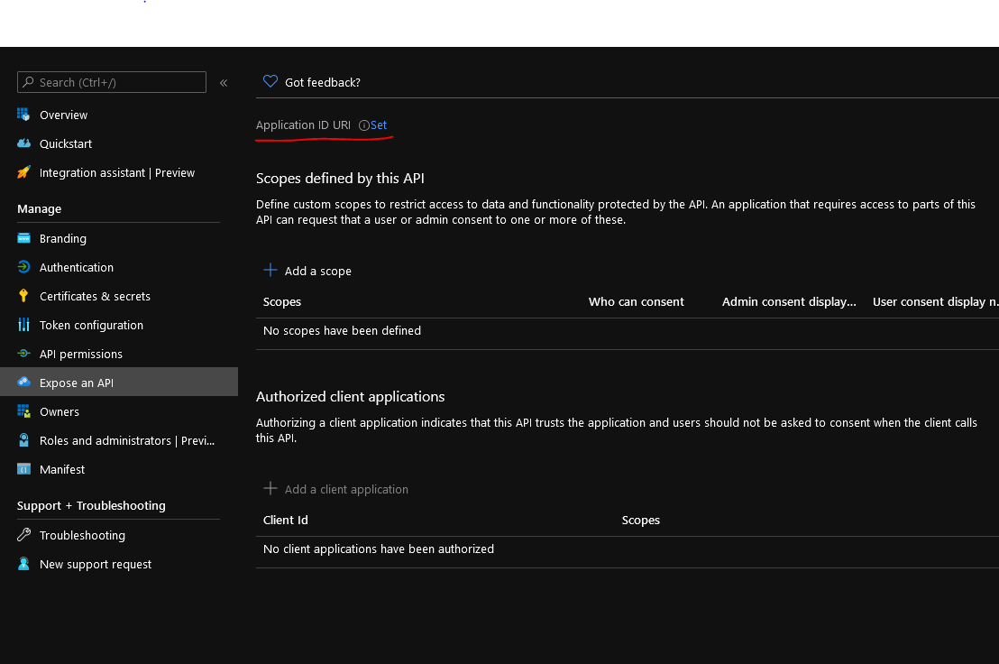

Using fastapi_aad_auth
**********************

``fastapi_aad_auth`` requires an Azure Active Directory App Registration (from the Azure Active Directory you want
the application to authenticate against), and these parameters should then be set in environment variables
(or a ``.env`` environment file) within the environment that fastapi is being served from.

Configuring the Azure Active Directory App Registration
~~~~~~~~~~~~~~~~~~~~~~~~~~~~~~~~~~~~~~~~~~~~~~~~~~~~~~~

There are several parts of the App Registration to Configure

In the Authentication Tab you need to configure the callback urls:

For the openapi/redoc authentication, configure a Single-page application eligible
for the Authorization Code Flow with PKCE for::

    https://<hostname>/docs/oauth2-redirect

e.g. for local development::

    http://localhost:8000/docs/oauth2-redirect

Configure a web platform for the UI based redirection (or whatever else is set in the config for the redirect path)::

    https://<hostname>/login/oauth/redirect

e.g. for local development::
    
    http://localhost:8000/login/oauth/redirect

Youu also need to decide whether the application is multi-tenant or single-tenant

.. figure:: figures/App-Registration-Redirect-URIs.PNG
   :alt: Overview of redirect URI configuration for local testing
   
   An example configuration for rediredt URIs for testing an application

On the expose an API tab, you need to set the Application ID URI

   
   An example configuration for api Scopes for testing an application

Configuring the fastapi environment
~~~~~~~~~~~~~~~~~~~~~~~~~~~~~~~~~~~

The configuration is defined in ``src/fastapi_aad_auth/config.py``, and includes options for configuring
the AAD config, the login UI and the routes.

There are several key parameters::

    AAD_CLIENT_ID="***"
    AAD_TENANT_ID="***"

You can initialise it with::

    from fastapi_aad_auth import AADAuth, AuthenticationState, Config
    auth_provider = AADAuth()

    # If you had a config that wasn't set in the environment, you could use 
    # auth_provider = AADAuth(Config(<my config kwargs>)

Including fastapi_aad_auth in your code
~~~~~~~~~~~~~~~~~~~~~~~~~~~~~~~~~~~~~~~

You can use it for fastapi routes::

    from fastapi import APIRouter, Depends

    # Use the auth_provider.api_auth_scheme for fastapi authentication

    router = APIRouter()

    @router.get('/hello')
    async def hello_world(auth_state: AuthenticationState =D epends(auth_provider.api_auth_scheme)):
        print(auth_state)
        return {'hello': 'world'}

For starlette routes (i.e. interactive/HTML pages), use the auth_provider.auth_required for authentication::

    from starlette.responses import PlainTextResponse

    @auth_provider.auth_required()
    async def test(request):
        if request.user.is_authenticated:
            return PlainTextResponse('Hello, ' + request.user.display_name)

This middleware will set the request.user object and request.credentials object::

    async def homepage(request):
        if request.user.is_authenticated:
            return PlainTextResponse('Hello, ' + request.user.display_name)
        return PlainTextResponse(f'Hello, you')

You can set the swagger_ui_init_oauth using auth_provider.api_auth_scheme.init_oauth::

    from fastapi import FastAPI
    app = FastAPI(...
                  swagger_ui_init_oauth=auth_provider.api_auth_scheme.init_oauth)

To add the required middleware to the fastapi app use::

    auth_provider.configure_app(app)

 
